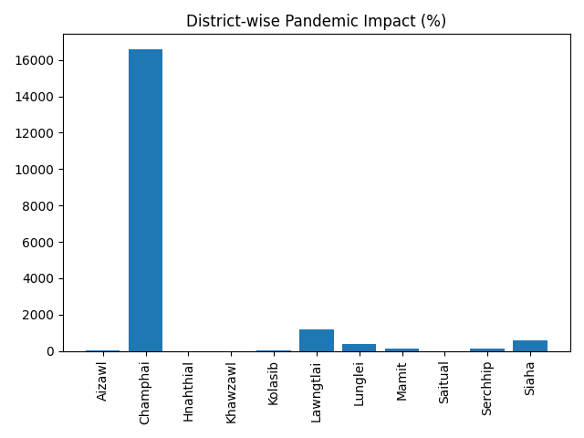

Pandemic Impact Analysis Model
📌 Project Overview

This project implements a Hybrid Metaheuristic Optimization Framework combining:

🐦 CSA (Crow Search Algorithm) – Exploration

🌀 PSO (Particle Swarm Optimization) – Exploitation

🧠 LSTM (Deep Learning Time-Series Model) – Forecasting

The goal is to analyze and forecast pandemic-related yearly trends using district-level data and optimize LSTM hyperparameters using hybrid evolutionary intelligence.

📊 Dataset

File:

IC_2.csv

Location:

C:\Users\NXTWAVE\Downloads\Pandemic Impact Analysis Model\

Structure:

SN

State

District

2017–2022 yearly values

The dataset is transformed into a time-series format and aggregated yearly.

⚙️ Model Architecture
🔹 Step 1: Data Processing

Melt yearly columns into time-series format

Aggregate yearly averages

Normalize values using MinMaxScaler

Train/Test Split:

Train: 2017–2020

Test: 2021–2022

🔹 Step 2: Hybrid Optimization
🐦 CSA (Initialization Phase)

Generates diverse candidate hyperparameters:

LSTM Units

Learning Rate

Epochs

🌀 PSO (Optimization Phase)

Velocity update rule

Personal best (pbest)

Global best (gbest)

Convergence tracking

🔹 Step 3: Final LSTM Training

Optimized LSTM structure:

LSTM(units = optimized_units)
Dense(1)

Loss Function:

Mean Squared Error (MSE)

Optimizer:

Adam(learning_rate = optimized_lr)

📈 Evaluation Metrics

✅ RMSE (Root Mean Squared Error)

✅ R² Score

✅ Convergence Curve

✅ Prediction Visualization

✅ Correlation Heatmap

📂 Output Files (All prefixed with psa_)
File	Description
psa_pandemic_model.keras	Optimized LSTM model
psa_results.csv	Best hyperparameters + RMSE + R²
psa_predictions.json	Actual vs Predicted values
psa_accuracy_graph.png	RMSE visualization
psa_prediction_graph.png	Actual vs Predicted comparison
psa_heatmap.png	Year correlation heatmap
psa_convergence.png	Optimization convergence curve
📊 Graph Descriptions
1️⃣ Accuracy Graph

Shows RMSE of Hybrid CSA-PSO model.

2️⃣ Prediction Graph

Displays:

Actual values (2021–2022)

Predicted values

3️⃣ Heatmap

Correlation between yearly trends across districts.

4️⃣ Convergence Curve

Shows optimization improvement across iterations.

🧪 Research Contribution

This project demonstrates:

Hybrid Metaheuristic Deep Learning Optimization

Pandemic Structural Impact Forecasting

Time-Series Hyperparameter Optimization

Evolutionary Intelligence + Deep Learning Integration

🧠 Why Hybrid CSA + PSO?
CSA	PSO
Strong exploration	Strong exploitation
Avoids local minima	Fast convergence
Diversifies search	Refines best candidates

Together:

Better global optimization stability and convergence reliability.

🖥️ Requirements

Install dependencies:

pip install numpy pandas matplotlib seaborn scikit-learn tensorflow statsmodels

▶️ How to Run
python your_script_name.py

All outputs will automatically be saved in:

C:\Users\NXTWAVE\Downloads\Pandemic Impact Analysis Model\

📌 Research Extensions (Future Work)

Multi-objective CSA–PSO optimization

Confidence interval forecasting

District-wise independent modeling

Compare with:

GA

BA

AIS

Pure PSO

Statistical significance testing

Real-time dashboard (Streamlit)

Automated PDF report generation

📄 Suggested Research Paper Title

Hybrid Crow–Particle Swarm Optimized LSTM Framework for Pandemic Impact Time-Series Forecasting

👨‍💻 Author
Sagnik Patra
Developed as part of a hybrid metaheuristic deep learning research framework.
